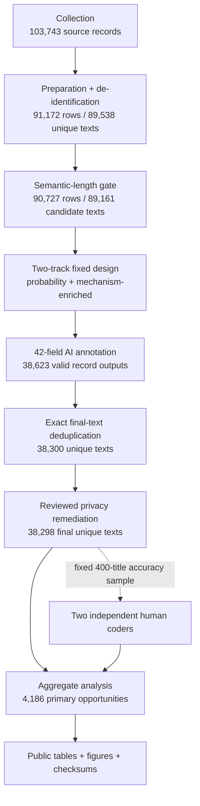

# Public pipeline map

This repository shows the final research system at every consequential node.
It intentionally omits the history of intermediate reports, abandoned drafts,
retry narratives, and internal handoffs.

## What can be inspected at each node

| Stage | Public implementation | Public status evidence | Restricted material |
| --- | --- | --- | --- |
| Collection | Configurable crawler, parser, pagination, resumption, MySQL store and export | [`01_collection.json`](artifacts/stages/01_collection.json) | Real sources, selectors, URLs, credentials, snapshots |
| Preparation | Ordered rule engine, audit hashes, semantic-length rule and exact deduplication | [`02_preparation.json`](artifacts/stages/02_preparation.json), [`03_semantic_length_gate.json`](artifacts/stages/03_semantic_length_gate.json) | Real titles, production literal dictionaries, row logs |
| Sampling | Stable SHA-256 ranking, Hamilton allocation, probability/enriched track separation | [`04_sampling_and_annotation.json`](artifacts/stages/04_sampling_and_annotation.json) | Frame membership, source-cell counts, per-title hashes |
| Annotation | Full prompt, codebook, 42-field Schema and layered runtime validators | [`04_sampling_and_annotation.json`](artifacts/stages/04_sampling_and_annotation.json) | Provider responses, per-title evidence, credentials |
| Final deduplication | Exact-final-text grouping and deterministic retention | [`05_final_text_deduplication.json`](artifacts/stages/05_final_text_deduplication.json) | Member tables and representative crosswalks |
| Privacy | Exact-span application, re-deduplication, direct-locator gate | [`06_privacy_remediation.json`](artifacts/stages/06_privacy_remediation.json) | Literal evidence, review decisions, private lexicons |
| Human review | Agreement, kappa, confusion and AI-comparison aggregation | [`07_human_review.json`](artifacts/stages/07_human_review.json) | Review assignments, titles, item-level labels |
| Analysis | Paired estimators, accounting checks, table-to-figure reproduction | [`08_analysis.json`](artifacts/stages/08_analysis.json) | Title-by-label matrix |
| Publication | Fail-closed boundary checks, deterministic builds, SHA-256 manifest and CI | [`09_publication_gate.json`](artifacts/stages/09_publication_gate.json) | Manuscript, submission files and internal logs |

## Reproducibility levels

The repository supports three deliberately different levels:

1. **Fully runnable with synthetic inputs:** collection parsing, preprocessing,
   two-track sampling, privacy remediation/gating, and review aggregation.
2. **Fully verifiable from public aggregate inputs:** result accounting,
   summaries, figures, checksums, and CI.
3. **Inspectable but not independently rerunnable on real records:** the
   restricted title-level steps. Their algorithms and final aggregate stage
   states are public, while confidential inputs and outputs are not.

That boundary allows methodological inspection without publishing text that
could expose sensitive source material or enable title-level reconstruction.
